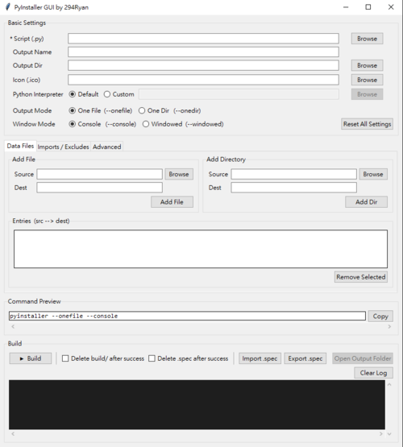

# PyInstaller GUI

A lightweight, cross-platform GUI frontend for [PyInstaller](https://pyinstaller.org), built with Python's standard `tkinter`. Configure, preview, and run PyInstaller builds without touching the command line.



---

## Table of Contents
- [Key Features](#key-features)
- [Instructions for Use](#instructions-for-use)
- [Development Guidelines](#development-guidelines)
- [Technologies Used](#technologies-used)
- [Project Structure](#project-structure)
- [Notes](#notes)

---

## Key Features

- **Visual build configuration** — Set script, output name, output directory, icon, and interpreter through a point-and-click interface; no CLI flags to memorize.
- **Real-time command preview** — The generated `pyinstaller` command updates live as you adjust settings, and can be copied to clipboard with one click.
- **Data Files tab** — Add individual files or entire directories as bundled resources, with automatic `src → dest` path management.
- **Imports / Excludes tab** — Manage `--hidden-import` and `--exclude-module` lists via an inline list editor.
- **Advanced tab** — Inject arbitrary raw PyInstaller flags for edge cases.
- **`.spec` import / export** — Load an existing `.spec` file to populate all fields, or export the current configuration as a `.spec`.
- **Organized output** — Build artifacts are automatically moved into a dedicated `<name>_Output/` folder; optional post-build cleanup deletes `build/` and `.spec`.
- **Cross-platform** — Runs on Windows, macOS, and Linux.

---

## Instructions for Use

Download the latest release from [Releases](./releases) and extract it.

- **Launch (executable):**
  ```
  tk_pyinstaller_gui_vX.X.X.exe
  ```
- **Launch (from source):**
  ```
  python tk_pyinstaller_gui.py
  ```

**Feature Overview:**

1. **Basic Settings**
   Select the target `.py` script, output name, output directory, `.ico` icon, and Python interpreter (default or custom path). Choose between `--onefile` / `--onedir` and `--console` / `--windowed`.

2. **Data Files**
   Add files or directories to be bundled. Specify source and destination paths; entries are listed in `src --> dest` format and can be removed individually.

3. **Imports / Excludes**
   Manage `Hidden Imports` and `Exclude Modules` lists. Entries are reflected immediately in the command preview.

4. **Advanced**
   Enter raw PyInstaller flags (space-separated) for options not covered by the UI, e.g. `--clean --noupx`.

5. **Command Preview**
   Displays the full `pyinstaller` command assembled from your current settings. Use **Copy** to grab it for manual use.

6. **Build**
   Click **▸Build** to start. Output is streamed to the log panel in real time. On success, artifacts are moved to `<Output Dir>/<name>_Output/`. Optionally auto-delete `build/` and `.spec` after a successful build.

7. **`.spec` Import / Export**
   **Import .spec** parses an existing spec file and populates all fields. **Export .spec** writes the current configuration as a `.spec` file.

---

## Development Guidelines

1. Clone the repository:
   ```
   git clone https://github.com/294Ryan/PyinstallerGUI.git
   ```

2. **Programming Language:** Python 3.x

3. **Dependencies:**
   - Standard library only (`tkinter`, `subprocess`, `threading`, `shutil`, `os`, `sys`, `re`) — no `pip install` required.
   - PyInstaller must be installed in the target Python environment for builds to run:
     ```
     pip install pyinstaller
     ```

4. Run directly from source:
   ```
   python tk_pyinstaller_gui.py
   ```

5. Refer to [Technologies Used](#technologies-used) and [Project Structure](#project-structure) as needed.

---

## Technologies Used

- **Python 3 / tkinter** — UI framework; standard library, no external GUI dependency.
- **PyInstaller** — The underlying packaging tool invoked via `subprocess`; must be installed separately.
- **threading** — Build process runs on a background thread to keep the UI responsive during long builds.

---

## Project Structure

```
PyinstallerGUI/
├── .gitignore                  # Git ignore rules
├── README.md                   # This file
└── tk_pyinstaller_gui.py       # Single-file application entry point
```

---

## Notes

- Maintainer: 294Ryan — [GitHub](https://github.com/294Ryan)
- Terms of Use: `GPL-3.0 license`
- <!> Please use this product only within the scope permitted by the terms and conditions of this project. You are solely responsible for any consequences arising from operational errors or improper use.
