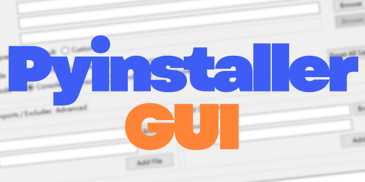

<!---------------- LINKS_START -------------------->

[release_badge]: https://img.shields.io/github/release/294Ryan/PyinstallerGUI?color=red&label=Release&style=flat-square
[star_badge]: https://img.shields.io/endpoint?color=yellow&url=https://api.pinstudios.net/api/badges/stars/294Ryan/PyinstallerGUI&style=flat-square
[license_badge]: https://img.shields.io/badge/License-GPL--3.0-orange?color=orange&style=flat-square
[os_badge]: https://img.shields.io/badge/Platform-Windows_%7C_macOS_%7C_Linux-blue?style=flat-square
[contributors_badge]: https://contrib.rocks/image?repo=294Ryan/PyinstallerGUI

[last_release]: https://github.com/294Ryan/PyinstallerGUI/releases/latest
[release]: https://github.com/294Ryan/PyinstallerGUI/releases
[star]: https://github.com/294Ryan/PyinstallerGUI/stargazers
[license]: https://github.com/294Ryan/PyinstallerGUI/blob/main/LICENSE
[contributors]: https://github.com/294Ryan/PyinstallerGUI/graphs/contributors

<!----------------- LINKS_END --------------------->

<div align='center'>
  
  <br>
  <h3>A lightweight GUI frontend for PyInstaller — configure, preview, and build without touching the CLI.</h3>

  
  <br>

  [![Release][release_badge]][last_release]
  [![Stars][star_badge]][star]
  [![License][license_badge]][license]
  ![Platform][os_badge]
  <br>

  [Quick Start](#quick-start) | [Features](#features) | [Usage](#usage) | [License](#license) | [Contributors](#contributors)

  

</div>

---

## **Quick Start**

> [!NOTE]
> **Requirements:**
> - Python 3.x (when running from source)
> - PyInstaller installed in the target Python environment

- **Direct Download (Recommended):** Go to [Releases][release], download the latest version, and run the executable directly — no installation needed.
- **Run from Source:**
  ```
  git clone https://github.com/294Ryan/PyinstallerGUI.git
  cd PyinstallerGUI
  python tk_pyinstaller_gui.py
  ```

> [!TIP]
> PyInstaller must be available in whichever Python environment you intend to build with:
> ```
> pip install pyinstaller
> ```

---

## **Features**

- **Visual build configuration** — Set script, output name, output directory, icon, and Python interpreter through a point-and-click interface; no CLI flags to memorize.
- **Real-time command preview** — The generated `pyinstaller` command updates live as you adjust settings, and can be copied to clipboard with one click.
- **Data Files tab** — Add individual files or entire directories as bundled resources, with automatic `src → dest` path management.
- **Imports / Excludes tab** — Manage `--hidden-import` and `--exclude-module` lists via an inline list editor.
- **Advanced tab** — Inject arbitrary raw PyInstaller flags for edge cases.
- **`.spec` import / export** — Load an existing `.spec` file to populate all fields, or export the current configuration as a `.spec`.
- **Organized output** — Build artifacts are automatically moved into a dedicated `<name>_Output/` folder; optional post-build cleanup deletes `build/` and `.spec`.
- **Cross-platform** — Runs on Windows, macOS, and Linux.

---

## **Usage**

### Basic Settings
Select the target `.py` script, output name, output directory, `.ico` icon, and Python interpreter (default system Python or a custom path). Choose between `--onefile` / `--onedir` and `--console` / `--windowed`.

> Selecting a script auto-fills **Output Name** and **Output Dir** if left empty.

### Data Files
Add files or directories to bundle. Specify source and destination paths; entries are listed in `src --> dest` format and can be removed individually.

### Imports / Excludes
Manage **Hidden Imports** and **Exclude Modules** lists. Entries reflect immediately in the command preview.

### Advanced
Enter raw PyInstaller flags (space-separated) for options not covered by the UI — e.g. `--clean --noupx`.

### Command Preview
Displays the full `pyinstaller` command assembled from your current settings. Use **Copy** to grab it for manual use.

### Build
Click **▸ Build** to start. Output is streamed to the log panel in real time. On success, artifacts are moved to `<Output Dir>/<name>_Output/`. Optionally auto-delete `build/` and `.spec` after a successful build.

### `.spec` Import / Export
- **Import .spec** — Parses an existing `.spec` file and populates all fields.
- **Export .spec** — Writes the current configuration as a `.spec` file.

---

## **Project Structure**

```
PyinstallerGUI/
├── images/
│   ├── Banner.png
│   └── tk_app.png
├── .gitignore
├── icon.ico
├── LICENSE
├── README.md
├── tk_pyinstaller_gui.py        # Single-file application entry point
└── tk_pyinstaller_gui.spec      # .spec file
```

---

## **License**
License: [GPL-3.0][license]

> [!WARNING]
> Please use the contents of this project within the scope permitted by the license. Users are solely responsible for any consequences resulting from improper or negligent use.

---

## **Contributors**
[![Contributors][contributors_badge]][contributors]

<br><br>
<div align="center">
  <a href="#top">Back to top</a>
</div>
